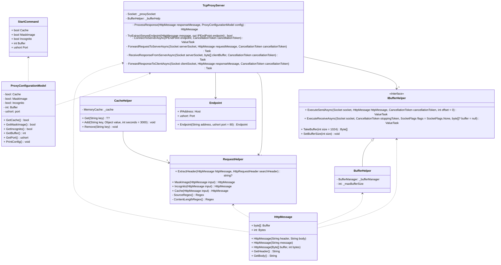
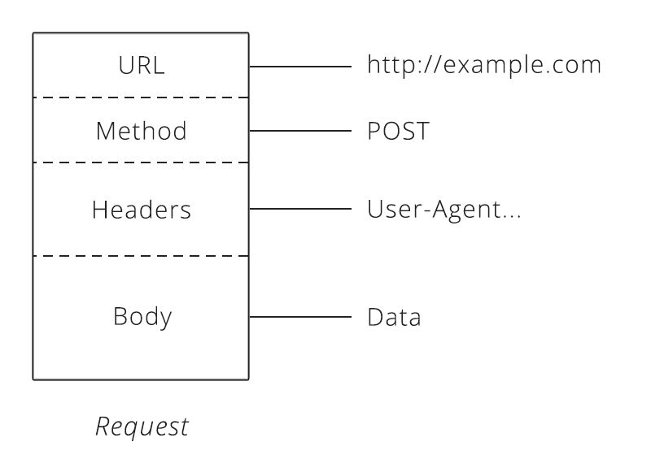

Student naam: Imre Boersma

Studentnummer: 632546

---

# Algemene beschrijving applicatie

Een proxy is een server die als tussenpersoon fungeert tussen een client en een andere server. Deze proxy heeft een aantal extra functionaliteiten:

- De proxy heeft een cache, waardoor de proxy de pagina's opslaat en deze niet opnieuw hoeft te downloaden als de pagina opnieuw wordt aangevraagd.
- De proxy vervangt alle afbeeldingen op de pagina door een placeholder, zodat de pagina sneller wordt geladen en reclames worden geblokkeerd.
- De proxy verwijdert alle headers die niet nodig zijn voor de server, zodat de server niet te veel informatie krijgt.

## Ontwerp en bouw van de applicatie

De applicatie is gebouwd met behulp van CliFX. CliFX is een framework dat is gebaseerd op JavaFX. CliFX is een wrapper om JavaFX die het makkelijker maakt om CLI applicaties te
maken. De applicatie is opgebouwd uit een aantal verschillende classes. Hieronder staan de belangrijkste classes weergegeven:



## Gebruik van de applicatie

De applicatie kan worden gestart met de volgende commando's:

Zorg ervoor dat de applicatie is gebouwd.
Navigeer naar `\bin\Debug\net7.0` en vind de TCPProxy.exe voer het volgende commando uit:

```bash
  TCPProxy.exe
```

De applicatie geeft een lijst met commando's weer. Om de applicatie te starten voer je het volgende commando uit:

```bash
  TCPProxy.exe start
```

De applicatie geeft een lijst met opties weer. Om de applicatie te starten met de opties `cache`, `maskImage` en `incognito` voer je het volgende commando uit:

```bash
  TCPProxy.exe start --cache --maskImage --incognito
```

## HTTP request en response

Voorbeelden van HTTP request en response zijn als volgt:

### Request

```http
GET / HTTP/1.1
Host: localhost:8080
Accept: text/html
```

In dit voorbeeld wordt er een `GET` request gestuurd naar `localhost:8080` met als accept type `text/html`. De `text/html` is de content type die de client accepteert. De server
kan hiermee bepalen welke content hij terug verwacht.

### Response

```http
HTTP/1.1 200 OK
Content-Type: text/html
Content-Length: 110

<html>
    <head>
        <title>Test</title>
    </head>
    <body>
        <h1>Test</h1>
    </body>
</html>
```

In dit voorbeeld wordt er een `200 OK` response terug gestuurd met als content type `text/html` en een lengte van 110 bytes. De content is de HTML die de server terug stuurt.

## TCP/IP

TCP/IP (Transmission Control Protocol/Internet Protocol) is een set van communicatieprotocollen die wordt gebruikt voor het verzenden van gegevens via een netwerk. TCP zorgt voor
een betrouwbare verbinding tussen twee endpoints door gegevens te verzenden in kleine pakketten en te controleren of alle pakketten zijn ontvangen. IP zorgt voor het routeren van
deze pakketten naar het juiste endpoint. Samen vormen deze protocollen de basis van het internet.

### Concepten

Hieronder staan een aantal termen beschreven die worden gebruikt in TCP.

- Initiator is een applicatie of service die een verbinding initieert. Bijvoorbeeld een client die een verbinding opent met een server.
- Receiver is een applicatie of service die een verbinding ontvangt. Bijvoorbeeld een server die een verbinding accepteert met een client.
- Handshake is het proces waarbij een initiator en een receiver een verbinding opzetten en bevestigen.
- Packet is een stukje gegevens dat wordt verzonden via een netwerk meestal in de vorm van een hoeveelheid bytes.
- Flags zijn specifieke bits in een packet. Deze bits geven aan hoe het packet behandeld moet worden of welke acties er uitgevoerd moeten worden. Voorbeelden zijn: SYN, FIN, RST,
  ACK en PSH.
- Retransmission is het proces waarbij een packet opnieuw wordt verstuurd omdat het niet is bevestigd door de receiver.

(TCP Flags - KeyCDN Support, 2022)

### Code voorbeeld

```tcp
SYN
Source Port: 12345
Destination Port: 80
```

In dit voorbeeld wordt er door de initiator een SYN(synchronize) packet gestuurd vanaf poort 12345 naar poort 80. De receiver zal hierop een SYN-ACK(synchronize-acknowledge) packet
terug sturen. Als de initiator dit ontvangt is de verbinding gemaakt. De initiator zal vervolgens een ACK(acknowledge) packet sturen naar de receiver om de verbinding te
bevestigen. De receiver zal vervolgens de data sturen die de initiator heeft aangevraagd. Als de initiator de data heeft ontvangen zal hij een FIN(finish) packet sturen naar de
receiver om de verbinding te beëindigen. De receiver zal vervolgens een FIN-ACK packet sturen naar de initiator om de verbinding te beëindigen. Hieronder een voorbeeld van een
packet met de SYN-ACK TCP-vlag:

```tcp
SYN-ACK
Source Port: 80
Destination Port: 12345
SYN Sequence Number: 14
ACK Sequence Number: 15
```

(danontech, 2012)

### Alternatieven

#### UDP

Het meest gebruikte alternatief voor TCP is UDP (User datagram Protocol). UDP is gemaakt voor applicaties waar je geen opeenvolgende data nodig hebt. Het werkt ongeveer hetzelfde
als TCP. UDP Heeft een header die net als een TCP header aan het begin van het packet wordt gezet. Dan wordt de data verstuurd over IP net zoals bij TCP. UDP doet echter minder dan
TCP. UDP verdeelt datagrams niet in verschillende packets. Het houd ook niet bij welke packets er al verstuurd zijn.

(Newton, 1987)

#### ICMP

ICMP (Internet Control Message Protocol) is een netwerk protocol die veelal gebruikt wordt door netwerk apparaten om netwerk communicatie fouten te diagnosticeren. Het wordt meest
gebruikt om na te gaan of data goed aankomt bij de bestemming maar kan ook gebruikt worden in DDoS aanvallen.

(What is the Internet Control Message Protocol (ICMP)?, z.d.)

## RFC HTTP/1.1

### Globale opbouw van een HTTP bericht



In de afbeelding hierboven is de globale opbouw van een HTTP request te zien. Een HTTP bericht bestaat uit een URL, een request/response lijn, een header en een body. De URL is de
bestemming van het bericht. De method is de actie die de client wil uitvoeren. De headers zijn de metadata van het bericht. De body is de data die de client wil verzenden.


In de afbeelding hierboven is de globale opbouw van een HTTP response te zien. Een HTTP response bestaat uit een status code, een header en een body. De status code is de status
van de response. De headers zijn de metadata van het bericht. De body is de data die de server terug stuurt.

### Hoe wordt de content in een HTTP bericht verpakt?

Er zijn verschillende manieren waarop de inhoud kan worden verpakt, afhankelijk van het type inhoud en het gebruikte protocol. Bijvoorbeeld, tekstuele inhoud kan worden verzonden
in de vorm van plain text of in een encoded vorm zoals JSON of XML. Binary inhoud zoals afbeeldingen of video's worden gewoonlijk verzonden in de originele binair formaat.

### Streaming content

Streaming content is het continu afspelen van audio of video via internet, zonder dat de gehele inhoud eerst moet worden gedownload. Dit wordt bereikt door het verzenden van kleine
stukjes van de inhoud (pakketten) via TCP. De ontvanger buffered deze pakketten en speelt ze af terwijl nieuwe pakketten worden ontvangen op de achtergrond. Er is een variabele
buffergrootte waarmee de inhoud kan worden afgespeeld zonder onderbrekingen, ook als de bandbreedte varieert of als er vertragingen zijn in het netwerk.

## Reflectie

### Wat kan er beter?

Ik heb veel tijd besteedn aan steeds opnieuw de code te refactoren. Ik heb hierdoor veel tijd verloren. Ik had beter kunnen focussen op het implementeren van de functionaliteit en
de code later kunnen refactoren.

Ook had ik beter kunnen nadenken over de structuur van de code. Ik had beter kunnen nadenken over de verschillende klassen en hoe deze met elkaar in verbinding staan.

### Feedback over opdracht

De opdracht was goed te doen. Ik denk dat het wel beter zou zijn als er wat meer uitleg was over de verschillende onderdelen van de opdracht. Ik had bijvoorbeeld niet geweten hoe
ik caching moest implementeren als ik dit niet al eens eerder had gedaan.

# Test cases

## case Normale GET request

### case beschrijving

De client stuurt een GET request naar de server. De server stuurt een response terug met een status code van 200.

### case handleiding

1. Start de TCP server
2. Start een HTTP client
3. Voer een GET request uit naar de server
4. Controleer of de server een response terug stuurt met een status code van 200

## case verwacht resultaat

De server stuurt een response terug met een status code van 200.

## case GET request met maskImage optie

### case beschrijving

De client stuurt een GET request naar de server met de maskImage optie. De server stuurt een response terug met een status code van 200. De response body bevat een afbeelding.

### case handleiding

1. Start de TCP server met de maskImage optie
2. Start een HTTP client
3. Voer een GET request uit naar een website met een afbeelding
4. Controleer of de server een response terug stuurt met een status code van 200
5. Controleer of de response body de afbeelding bevat
6. Controleer of de afbeelding is gemaskeerd

## case verwacht resultaat

De server stuurt een response terug met een status code van 200. De response body bevat een afbeelding. De afbeelding is gemaskeerd.

## case GET request met incognito optie

### case beschrijving

De client stuurt een GET request naar de server met de incognito optie. De server stuurt een response terug met een status code van 200. De response header bevat geen andere
headers dan de volgende headers:

- Content-Type
- Server
- Date

### case handleiding

1. Start de TCP server met de incognito optie
2. Start een HTTP client
3. Voer een GET request uit naar een website
4. Controleer of de server een response terug stuurt met een status code van 200
5. Controleer of de response header de volgende headers bevat:
    - Content-Type
    - Server
    - Date
6. Controleer of de response header geen andere headers bevat

## case verwacht resultaat

De server stuurt een response terug met een status code van 200. De response header bevat de volgende headers:

- Content-Type
- Server
- Date

# Bronnen

- Newton, S. E. (1987). Protocols other than TCP: UDP and ICMP. Geraadpleegd op 18 januari 2023, van <https://home.ifa.hawaii.edu/users/gmm/intro_ip/sec4.html>
- danontech. (2012, 20 maart). TCP/IP Basics - Episode 025 - TCP headers continued [Video]. YouTube. <https://www.youtube.com/watch?v=5z0dUccNFWY>
- What is the Internet Control Message Protocol (ICMP)? (z.d.). <https://www.cloudflare.com/en-gb/learning/ddos/glossary/internet-control-message-protocol-icmp/>
- TCP Flags - KeyCDN Support. (2022, 9 december). KeyCDN. <https://www.keycdn.com/support/tcp-flags>